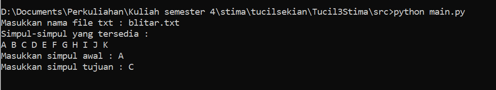
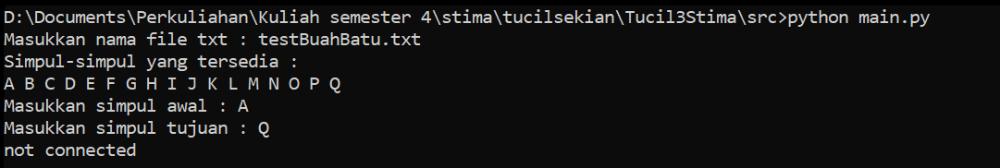
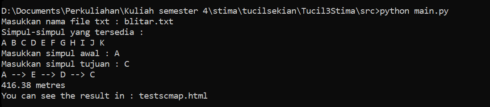
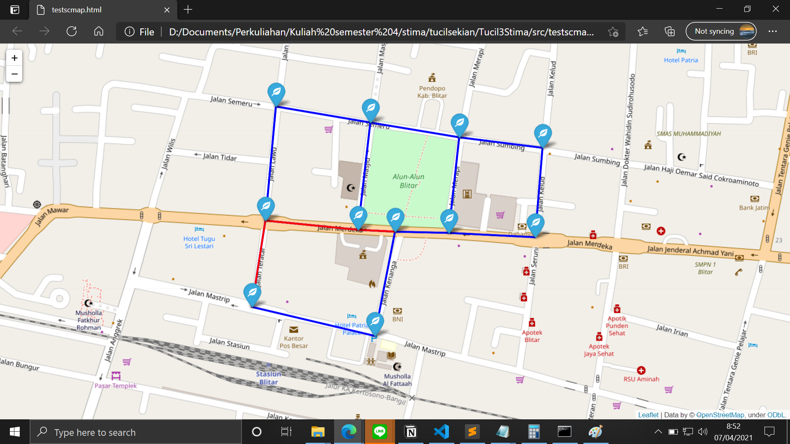
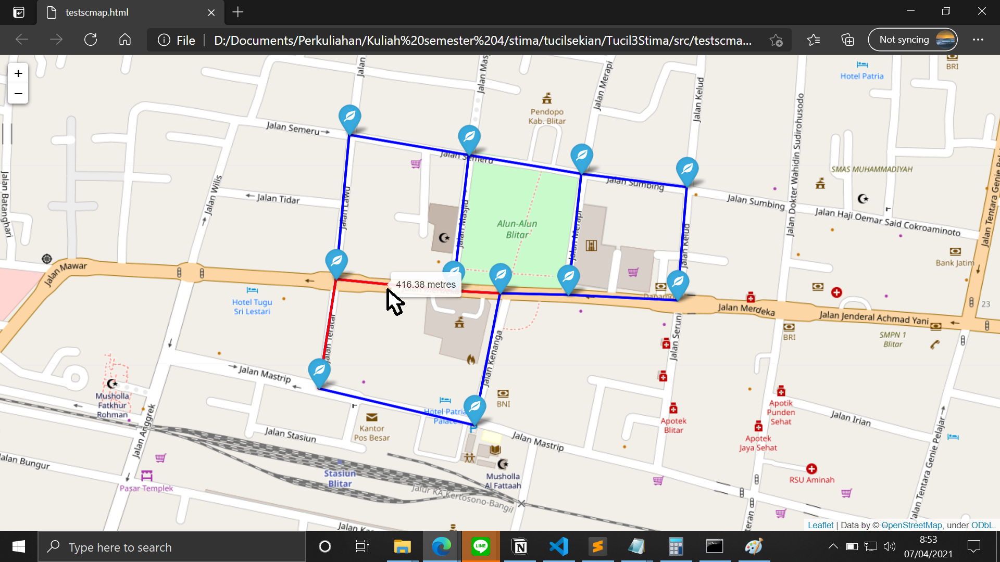

# Tugas Kecil Stima 3
> Pengaplikasian Algoritma A* untuk Mencari Lintasan Terpendek

## Daftar Isi
* [Dependencies](#dependencies)
* [Mempersiapkan Dependencies](#mempersiapkan-dependencies)
* [Mempersipkan Input Program](#mempersiapkan-input-program)
* [Memulai Program](#memulai-program)

## Dependencies
Sebelum memulai program, ada beberapa hal yang perlu dipersiapkan. Berikut dependencies yang diperlukan.

* Python dan PIP
* Folium
* Browser

## Mempersiapkan Dependencies
Berikut detail untuk mempersiapkan dependencies.

### Python dan PIP
Untuk Windows bisa segera ke link https://www.python.org/downloads/ dan mengikuti guide yang berlaku di link tersebut.

Untuk Ubuntu bisa menggunakan command line berikut pada terminal:
`sudo apt update`
`sudo apt install python3-pip`

### Folium
Ketika PIP sudah terpasang pada mesin anda, silahkan ketik command berikut pada terminal masing-masing.

`pip install folium`

## Mempersiapkan Input Program
Siapkan file txt yang menyatakan banyaknya lokasi sebesar N, nama lokasi beserta garis lintang dan garis bujurnya sebanyak N, serta matriks ketetanggaan dengan ukuran NxN. Berikut adalah contoh dari isi file txt.

11\
A -8.099045120315456 112.16493522999168\
B -8.100840204992812 112.16458117838853\
C -8.100340981063543 112.16244613993318\
D -8.098853927392977 112.16268217433529\
E -8.099013254834688 112.16429149980415\
F -8.099066363967909 112.16586863876363\
G -8.099140716742642 112.16737067586789\
H -8.097600549319546 112.16749942190542\
I -8.097419977580683 112.16605102898342\
J -8.097165052635042 112.16450607653333\
K -8.096888883761814 112.1628645645551\
0 1 0 0 1 1 0 0 0 0 0\
1 0 1 0 0 0 0 0 0 0 0\
0 1 0 1 0 0 0 0 0 0 0\
0 0 1 0 1 0 0 0 0 0 0\
1 0 0 1 0 0 0 0 0 1 0\
1 0 0 0 0 0 1 0 1 0 0\
0 0 0 0 0 1 0 1 0 0 0\
0 0 0 0 0 0 1 0 1 0 0\
0 0 0 0 0 1 0 1 0 1 0\
0 0 0 0 0 0 0 0 1 0 1\
0 0 0 1 0 0 0 0 0 1 0\

Setelah itu simpan file txt pada folder test agar bisa digunakan sebagai input program.
## Memulai Program
Untuk memulai program, ubah current directory ke folder src yang ada, kemudian ketik command line berikut di terminal masing-masing.

Pada Windows:
`python main.py`

Pada Ubuntu:
`python3 main.py`

Setelah itu, program akan meminta input nama file txt yang telah disiapkan. Ketik nama file txt dengan format "nama_file.txt".
Kemudian akan muncul nama-nama lokasi yang telah disiapkan di file input, pilih lokasi/simpul awal dan lokasi/simpul yang ingin dituju.

Kemudian akan muncul output, jika tidak terkoneksi (unconnected graph), maka program akan berhenti dan memberikan pesan bahwa kedua lokasi tidak terkoneksi.

Jika terkoneksi maka akan keluar output pada terminal yaitu rute yang dilewati beserta jaraknya.

Setelah output dari terminal keluar, program juga akan membuka default browser anda untuk membuka file html yang menggambarkan rute perjalanan. Rute ditandai dengan garis yang berwarna merah.

Untuk melihat jarak tempuhnya, dekatkan cursor anda ke rute garis, maka akan muncul jarak yang harus ditempuh.

